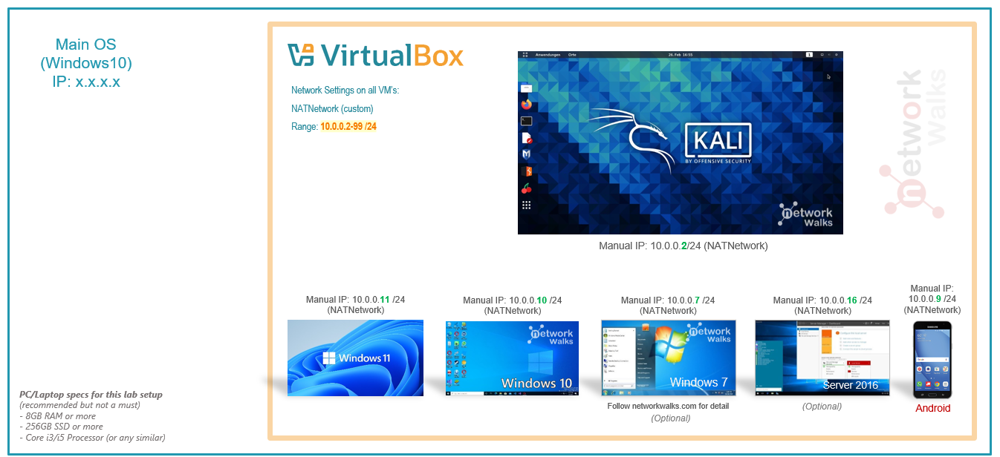
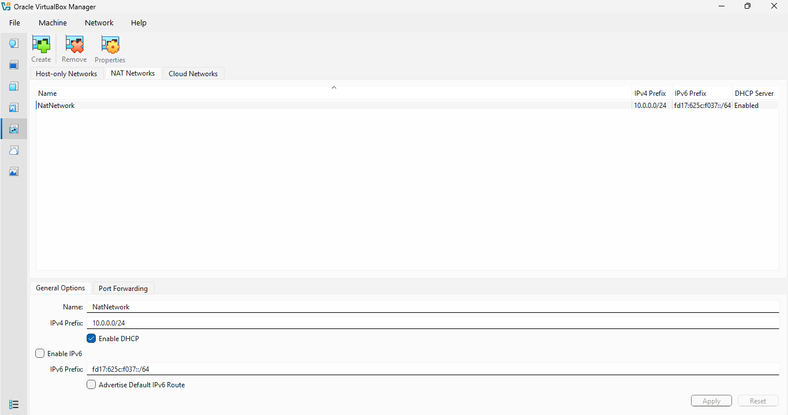
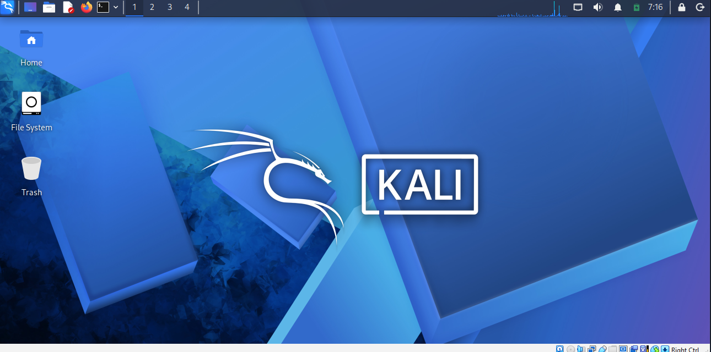
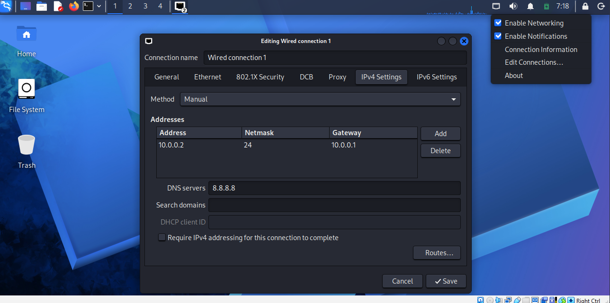

# networkwalks-B083-week1-Cybersecurity-lab-setup-
Kali Linux Lab Setup
<div align="center">

# 🔐 Cybersecurity Lab Environment Setup

**Building an isolated virtual lab for penetration testing and ethical hacking practice**
</div>

<p align="center">
  
  
  
  
  
  
  
  
    
  
  

</p>

---

## 📌 Project Overview

This project covers setting up a **virtual cybersecurity and penetration-testing laboratory** using VirtualBox and Kali Linux.

The goal was to build a controlled, isolated environment where cybersecurity tools, network scanning, reconnaissance, vulnerability assessment, and other security-testing activities can be performed safely and repeatedly, without risking any real production system.

The lab runs on a private virtual network so that additional target machines can be added later for authorized security-testing exercises.

---

## 🎯 Objectives

The main objectives of this project were to:

- Install and configure VirtualBox.
- Install/import Kali Linux as a virtual machine.
- Create a private **NAT Network** for the cybersecurity lab.
- Configure network connectivity for the Kali Linux VM.
- Assign a consistent IP address to the Kali VM.
- Verify network connectivity and DNS resolution.
- Take a clean VM snapshot for recovery.
- Document the full setup process, including issues faced and how they were resolved.
- Prepare the environment for future cybersecurity projects.

---

## 🛡️ Purpose of the Lab

This lab provides an isolated, controlled environment for cybersecurity learning and authorized security testing. It can be used for activities such as:

- Network reconnaissance
- Port scanning
- Vulnerability assessment
- Packet analysis
- Web security testing
- Exploitation practice
- Security-tool experimentation

⚠️ **Important:** This laboratory is only to be used against systems I own or have explicit permission to test. It is not used against any unauthorized system.

---

## 🏗️ Lab Architecture



Additional target machines can be added to the same virtual network in future projects.

---

## ⚙️ Lab Configuration

| 🧩 Component       | ⚙️ Configuration     |
| ------------------ | -------------------- |
| 🖥️ Host OS         | Windows 11            |
| 🧠 Host RAM        | 16 GB                 |
| ⚡ Processor       | Intel Core i7         |
| 🧰 Hypervisor      | VirtualBox 7.2        |
| 🐉 Security OS     | Kali Linux 2026.2     |
| 🧠 Kali RAM        | 4096 MB               |
| 🌐 Virtual Network | NAT Network           |
| 📡 Network Address | 10.0.0.0/24           |
| 🐧 Kali IP Address | 10.0.0.2/24           |
| 🚪 Default Gateway | 10.0.0.1              |
| 🌍 DNS Server      | 8.8.8.8               |
| 🔮 Future VM Range | 10.0.0.3–10.0.0.99    |


---

# 🪜 Lab Setup Procedure

## Step 1. Install 7-Zip

7-Zip was installed to extract the Kali Linux virtual-machine package, which was distributed as a `.7z` archive.

**Tool:** 7-Zip

---

## Step 2. Install VirtualBox

VirtualBox was installed as the hypervisor for the lab.

---

## Step 3. Create the NAT Network

A dedicated NAT Network was created in VirtualBox:

```text
Network Name: NatNetwork
IPv4 Prefix:  10.0.0.0/24
DHCP:         Enabled
IPv6:         Disabled
```



A NAT Network was chosen because multiple VMs attached to it can communicate with each other while still having outbound internet access 

This will let future attacker and target VMs talk to one another within the lab.

---

## Step 4. Import Kali Linux

Kali Linux was downloaded from the official Kali Linux website and imported into VirtualBox.

The VM's network adapter was configured as follows:

```text
Adapter 1
Attached to: NAT Network
Network:     NatNetwork
Adapter Type: Intel PRO/1000 MT Desktop
```

The VM was allocated:

```text
RAM: 4096 MB
```



A shared folder was also set up for transferring files between the host machine and the Kali VM.

---

## Step 5. Configure the Kali Linux Network

The Kali network was checked and configured with a consistent IPv4 address:

```text
IP Address: 10.0.0.2
Subnet Mask: 255.255.255.0
Gateway: 10.0.0.1
DNS: 8.8.8.8
```



A fixed IP makes the lab easier to document and reference in future exercises.

---

## Step 6. Create a Clean VM Snapshot

Once the initial configuration was complete, a VirtualBox snapshot was taken:

```text
Clean Kali - Network Setup
```

This snapshot is the clean baseline of the lab. If a future exercise breaks or misconfigures the VM, it can be restored back to this point.

---

# 🔎 Lab Verification

| ✅ Test                        | 🧾 Command                      | 🎯 Expected Result              |
| ----------------------------- | -------------------------------- | -------------------------------- |
| 🌐 Check IP address           | `ip a`                           | Correct Kali IP displayed        |
| 📡 Test gateway               | `ping 10.0.0.1`                  | Successful replies               |
| 🌍 Test Internet connectivity | `ping 8.8.8.8`                   | Successful replies               |
| 🔎 Test DNS resolution        | `nslookup google.com`            | Domain resolves                  |
| 🧰 Verify Nmap                | `nmap --version`                 | Nmap version displayed           |
| 🔄 Verify snapshot            | Restore snapshot and run `ip a`  | Baseline configuration restored  |

### Example Results

```text
IP Address:
10.0.0.2/24

Gateway:
10.0.0.1

DNS:
8.8.8.8
```

---

# 🐞 Problems Encountered & Solutions

## Problem 1. Internet Connectivity After Static IP Configuration

After manually setting the static IPv4 config, internet connectivity briefly dropped depending on the NetworkManager configuration.

Workaround used:

```bash
sudo nmcli connection modify "Wired connection 1" ipv4.dad-timeout 0
```

The connection was then restarted and connectivity re-tested.

> **Note:** Interface/connection names can differ between systems — check your actual connection name before running an `nmcli` command.

---

## Problem 2. VirtualBox VT-x / Virtualization Error

The Kali VM initially failed to boot because hardware virtualization was disabled in BIOS/UEFI.

Fixed by:

1. Restarting the computer.
2. Entering BIOS/UEFI settings.
3. Enabling Intel VT-x / hardware virtualization.
4. Saving and restarting.
5. Booting the Kali VM again — it started successfully.


---

# 💡 What I Learned

### 1. NAT vs NAT Network
A standard NAT and a NAT Network serve different purposes — a NAT Network lets multiple VMs on the same virtual network talk to each other while still providing outbound NAT connectivity, which is what makes a multi-machine lab possible.

### 2. Virtual Machine Networking
How VirtualBox's virtual adapters connect VMs to different network types, and how that configuration affects inter-VM communication.

### 3. Static IP Configuration
How to set and verify IPv4 addressing, subnet masks, gateways, and DNS in Kali Linux.

### 4. VM Snapshots
Why a clean snapshot should always be taken before risky or experimental work — it gives a known-good recovery point.

### 5. Documentation
Why documenting commands, configuration, screenshots, problems, and fixes properly is a core part of doing cybersecurity work professionally.

---

# 🔐 Security & Ethical Use

This lab is strictly for educational purposes and authorized testing only.

---

# 🔗 Tools & Resources

- **7-Zip:** [https://7-zip.org/download.html](https://7-zip.org/download.html)
- **VirtualBox:** [https://virtualbox.org/wiki/Downloads](https://virtualbox.org/wiki/Downloads)
- **Kali Linux:** [https://kali.org/get-kali](https://kali.org/get-kali)

---

# 👤 Author

**Syed Muhammad Farjaz**

---

## 📌 Project Information

**Week:** 01 | **Project:** Cybersecurity & Pentesting Lab Setup | **Repository:** GitHub
